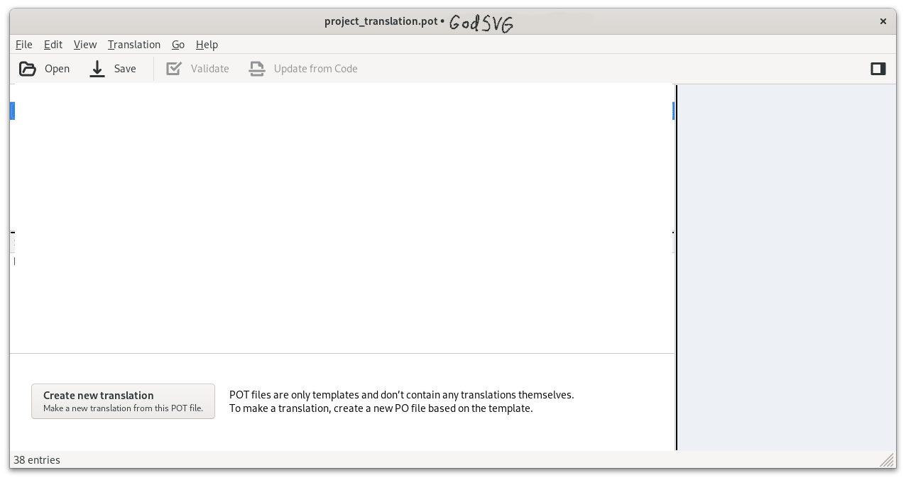
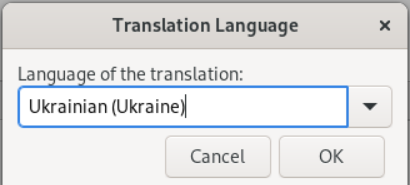
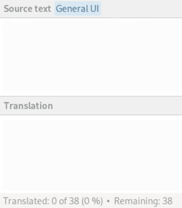
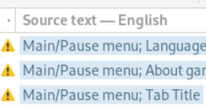
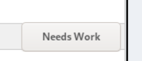
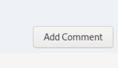
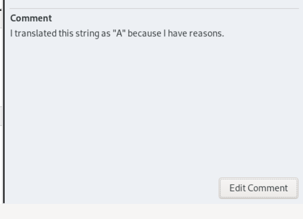
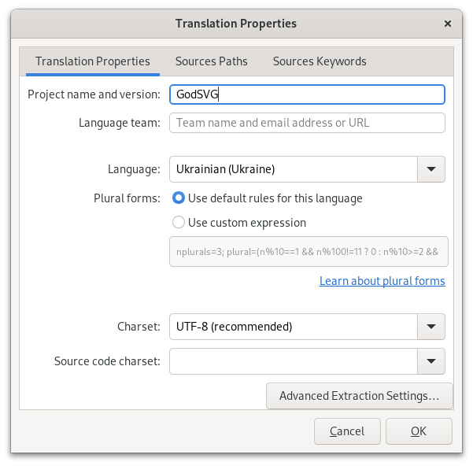
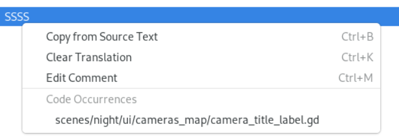

Thank you for your interest in contributing to GodSVG!

## Translations
You can help by contributing translation(s)! Don't worry, even if you totally new to software translations, this guide got you covered!

Whatever you are new or experienced, you need to do some preparations:

* Download [Godot](https://godotengine.org/). It available for many platforms, including Windows and Linux. You will need it to open project and test your translation.
* (Optionally) download program to work with `pot` and `po` files. Best one out here is [Poedit](https://poedit.net/download/)

	_po files allow you to work with them using nothing but text editor. Detailed explained [here](#working-on-translation-without-additional-tools)_

* Clone or download repo to your device.
	
_if you already have configured git, it is as easy as:_

```bash
git clone git@github.com:MewPurPur/GodSVG.git
```

Next step will be explained with usage of Poedit. If you other graphical program to work with `po`, most of steps will stay same, with some exceptions specific to your software.

#### Adding new translation

1. Navigate to root folder and then `translations`.

2. Open `GodSVG.pot` file inside it with Poeditor.

_in most systems is simple as right click on file, then "Open with..."_

3. You will greeted with main interface of Poedit. Click on "Create new translation..."



4. In opened menu you can choose language that you need. Type name of it (or pick from drop down menu) and if needed, pick regional locale (for example, if you would pick Russian language, there Russian for some regions (like, ru_BY) or Russian for entire country (ru_RU).

Note: it's important to pick right language, since Poedit will apply for you some regional configuration to po file, such as pluralization formula, correct locale, correct string coding. Of course, you will be able to pick this options yourself, but it is better to leave to program if you not sure what to pick.



5. After that, you will see list of strings that you need to translate.

_But before you start translating, save your file. Poedit will automatically pick right name for your language file. Just make sure that you save it in `translations` folder near `pot` file._

6. Translate it!

[Check quick guide on essential features of Poedit](#quick-guide-on-how-to-work-with-poedit)

#### Updating existing translation
1. Navigate to root folder and then `translations`.

2. Open `*locale_code*.po` file inside with Poeditor.

_`*locale_code*` refers to locale code that depends on language title and, if applicable, to regional variant. More about them you can read on [Godot wiki](https://docs.godotengine.org/en/stable/tutorials/i18n/locales.html)._

_For example, Ukrainian localization for Ukraine will be written as `uk_UA`, Russian for Russia will be `ru_RU` and United States English will be `en_US`._

3. Update this translation against `pot` file, in case developer added or changed some strings. To do so, go to top bar `Translation` -> `Update from POT file...` where you will be prompted to pick pot file. Pick `GodSVG.pot`. After that, you can update translation.

[Check quick guide on essential features of Poedit](#quick-guide-on-how-to-work-with-poedit)

#### Quick guide on how to work with Poedit
Pick any line that you want to translate (to navigate using keyboard, use `ctrl + arrow up/down`) and in bottom you will see this:



"Source text" is original text that you need to translate from. Blue tags near will inform you in which context this line appears.

"Translation" is where your translation should be. Poedit has support for spellcheck dictionaries, so if you will input something with typos, this word will be highlighted and with right click on it, Poedit will propose you to replace it with other word from list.

"Translated 0 of 38" is informing you how much strings there left to translate.

Be default, Poedit will move lines with errors to topmost of list and will add warning symbol:



"errors" here means:

If line ends not on same punctuation symbol as source (. , ! : etc), or if source string ends on newline, but your translation don't. You can ignore this warnings as they don't break anything (unless translated string strictly require you to add newline or have same end symbol) if your language doesn't require same punctuation as English.

_pro tip: go to top bar, `View` -> `Show Warnings` to show/hide this warnings._ 

To sort strings by some meaning, use same `View` menu:


You can sort and group string as you want.

_pro tip: I recommend you to turn on "Untranslated Entries First", so that less likely that you oversight untranslated strings and to turn on "Group by Context" so it will be easier to know which string correspond which context._



You can click this button to make/unmake string "fuzzy". "Fuzzy" string will be ignored in GodSVG as they never existed.
Also, fuzzy string will be marked with orange color:


In right-bottom corner you will found comment button:



This is translation file comments that you can add or read or edit per any entry. It is indented for you and future translators, where you could explain reasons why you translated string in certain manner or why you unsure if this particular string translated in right way (in combination with fuzzy, you can disable that entry and explain why you did so, so other translators will be able to know reasons).
Comment will look something like that:



Also, strings with comments will have this icon:


 So you know that there comments that you might want to check first.

With `Alt + Enter` or top bar, `Translation` -> `Properties`, you can edit some properties about this translation.



usually, you have no reasons to go into this menu. But if you need, you can change some properties.

You can right click on any string to open menu with some functions:



Copy text from source to translation, clear translation, edit comment that I mentioned before, and see where this string was extracted from. If same line was used in several places, then there will be several patches.

## Working on translation without additional tools

First thing that you should know is that `pot` and `po` files are, in fact, same files. POT is just template file, that has all information that po has, minus regional and data information, such as locale code (`uk_UA`, `en_US`, etc) or pluralization formula (more about pluralization formula you can check in [gettext manual](https://www.gnu.org/software/gettext/manual/html_node/Plural-forms.html).

So in most cases, you can just grab pot file, add information about locale and plural formula (if needed) manually and work as is.

#### Create new translation

1. Copy `pot` file. In copy change `pot` extension to `po`, and instead of name, you can give locale name. 
_About locale code you can learn in [Adding new translation](#adding-new-translation)

2. There you will found something like that:

```gettext
#, fuzzy
msgid ""
msgstr ""
"Project-Id-Version: One Night at Godot\n"
"MIME-Version: 1.0\n"
"Content-Type: text/plain; charset=UTF-8\n"
"Content-Transfer-Encoding: 8-bit\n"
```

As you can guess, there no information about locale and plural formula.

To add language, paste this before "MIME-Version":

```gettext
"Language: uk_UA\n"
```

Where you should replace `uk_UA` with locale that you need.

And if needed, fill pluralization formula like this:

```
"Plural-Forms: nplurals=3; plural=(n%10==1 && n%100!=11 ? 0 : n%10>=2 && "
"n%10<=4 && (n%100<12 || n%100>14) ? 1 : 2);\n"
```

This one formula ill work with some Slavic languages, such as Ukrainian, Belarusian, Russian and some more.

There other information that you can add, but it is not needed for translation to work. If you curious, lean more [here](https://www.gnu.org/software/gettext/manual/html_node/Header-Entry.html).

3. You can now translate using any text editor.

#### Updating existing translation

Updating existing translation without using any additional tools, like Poedit or xgettext or at least diff, might be more time consuming and require manual work. So, if you can, please, consider using something to make process painless and fast, such as Poedit.

1. Open translation file that you want to update using text editor.

2. Open pot file using text editor.

3. If you don't have any tool to make process easy, using search function of text editor, check for missing entries in po file from pot file. If it doesn't exist, copy it over pot into po.

4. Once you done copying, translate it as usually.


#### Syntax

Syntax of po you can learn [here](https://www.gnu.org/software/gettext/manual/html_node/PO-Files.html). It is really easy, so around ~10 minutes will be enough to understand it. Most of important features were explained in [Quick guide on how to work with Poedit](#quick-guide-on-how-to-work-with-poedit), Poeditor just graphically implemented them.

But here quick recap:
```gettext

# Simplest entry.

#  Comment for translators (add 2 spaces after #)
#: lib/error.c:116 (path where this string was extracted in source)
msgid "Unknown system error" (message id and source string that you need to translate)
msgstr "Error desconegut del sistema" (your translated string)

# Example of plural message.
msgid untranslated-string-singular
msgid_plural untranslated-string-plural
msgstr[0] translated-string-case-0
...
msgstr[N] translated-string-case-n

# Example of long messages.
msgid ""
"Here is an example of how one might continue a very long string\n"
"for the common case the string represents multi-line output.\n"

# make string fuzzy. Add word "fuzzy" after #,
#: lib/error.c:116
#, fuzzy
msgid "Unknown system error"
msgstr "Error desconegut del sistema"

# Add context
#: lib/error.c:116
#, fuzzy
msgctxt "Context String"
msgid "Unknown system error"
msgstr "Error desconegut del sistema"
```

That's mostly all information that you need to know. But don't worry, once you will copy from `pot` file, all this information will be already there, so you don't need to manually type all of this.
With only exception of adding or removing some plural forms if your language require this.

## PR workflow

For code contributions, use the following workflow:

1. Fork the repository.
2. Create a new branch: `git checkout -b implement-gradients`
3. Make your modifications, add them with `git add .`
4. Commit your changes: `git commit -m "Implement linear gradients"`
5. Push to the branch: `git push origin implement-gradients`
6. Create a new pull request with a clear and informative title and describe your changes.

This is the preferred workflow, but tidiness is not as important as work being done, so feel free to do something else you're comfortable with.

After submitting your pull request, I (MewPurPur) will review your changes and may provide feedback or request modifications. Be responsive to any comments or suggestions. Once your pull request is approved, it will be merged. Afterward, you can delete your branch from your fork.

## Governance 

Before working on a PR, look through the list of issues to see if your PR will resolve any of them. If said issue is not assigned to anyone and you don't want anyone else to work on it,  ask to be assigned to the issue.

If an issue doesn't exist and you want to fix a bug, then it's a good practice, but not required, to make an issue for it. If you want to implement a more complex feature or overhaul a system, a proposal is required first.

Do understand that PRs with a large maintenance cost may be under high scrutiny because of their long-term responsibility, even in the absence of the original contributor.

## Code style

For scripts, only GDScript code is allowed. Follow the [GDScript style guide](https://docs.godotengine.org/en/stable/tutorials/scripting/gdscript/gdscript_styleguide.html). Most of its rules are enforced here. Additionally:

- Static typing is predominantly used.
- Comments are usually written like sentences with punctuation.
- Two spaces are used to separate code and inline comments.
- For empty lines in the middle of indented blocks, the scope's indentation is kept.
- Class names use `class_name X extends Y` syntax.
- `@export` for nodes is only used if the runtime structure is not known.

Don't make pull requests for code style changes without discussing them first (unless it's for corrections to abide by the ones described here). Pull requests may also get production tweaks to fix their style before being merged.
