## Translations

You can help by contributing to translation(s)! Don't worry, even if you totally new to software translations, this guide got you covered!

It's recommended to use [Poedit](https://poedit.net/download/) to work on translation, but using nothing other then [text editor](#working-on-translation-without-additional-tools) is also valid. 

#### Generating up-to-date pot file

Before proceeding, regenerate `pot` file.

1. Open Godot and GodSVG project in it.

2. Go to toolbar, `Project Settings...`

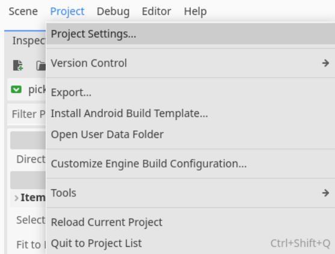

3. `Localization` -> `POT Generation` -> `Generate POT`

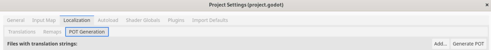

4. You will be prompted to save `pot` file. Overwrite `GodSVG.pot` with it.

#### Make Godot recognize new language

In case you adding new language, you need make Godot recognize your translation.

1. Go to toolbar, `Project Settings...`


2. `Localization` -> `Translations` -> `Add...`

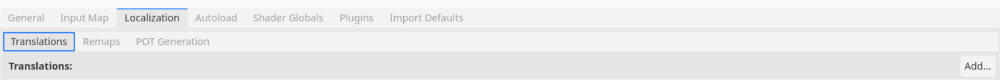

You will be prompted to provide `po` file of your translation.

#### Testing translation

1. Open Godot and GodSVG project.

2. Press `F5` or click "play" button.

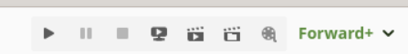

3. Once GodSVG will load, click on gear icon on top.

4. Change language.

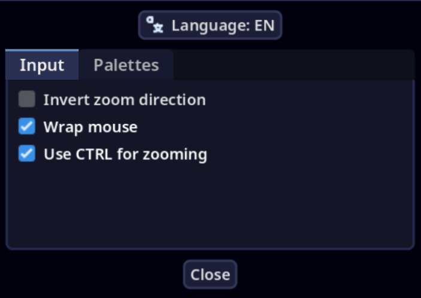

#### Adding new translation with Poedit

1. Navigate to root folder and then `translations`.

2. Open `GodSVG.pot` file inside it with Poedit.

_in most systems is simple as right click on file, then "Open with..."_

3. You will greeted with main interface of Poedit. Click on "Create new translation..."

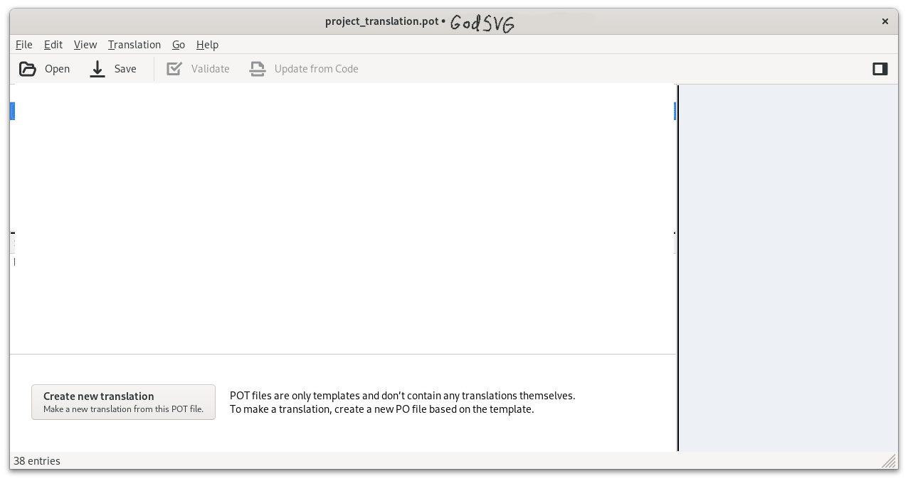

4. In opened menu you can choose language that you need. Type name of it (or pick from drop down menu) and if needed, pick regional locale (for example, if you would pick Russian language, there Russian for some regions (like, ru_BY) or Russian for entire country (ru_RU).

_Note: it's important to pick right language, since Poedit will apply for you some regional configuration to po file, such as pluralization formula, correct locale, correct string coding. You will be able to change this options later._

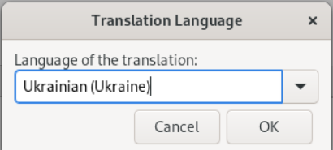

5. There will be list of strings that you need to translate.

_But before you start translating, *save your file*. Poedit will automatically pick right name for your language file. Just make sure that you save it in `translations` folder where `pot` file is._

6. Translate it!

[Quick guide on how to work with Poedit](#quick-guide-on-how-to-work-with-poedit).

#### Updating existing translation with Poedit

1. Navigate to root folder and then `translations`.

2. Open `*locale_code*.po` file inside with Poeditor.

_`*locale_code*` refers to locale code that depends on language title and, if applicable, to regional variant. More about them you can read on [Godot wiki](https://docs.godotengine.org/en/stable/tutorials/i18n/locales.html)._

_For example, Ukrainian localization for Ukraine will be written as `uk_UA`, Russian for Russia will be `ru_RU` and United States English will be `en_US`._

3. Update this translation against `pot` file. Go to top bar: `Translation` -> `Update from POT file...` and pick `GodSVG.pot`. 

4. Update translation.

[Quick guide on how to work with Poedit](#quick-guide-on-how-to-work-with-poedit).

#### Quick guide on how to work with Poedit

* To navigate between lines you can use cursor or to navigate using keyboard, use `ctrl + arrow up/down`. When you will pick any line, at bottom you will see menu:

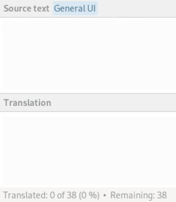

`Source text` is original text that you need to translate from. Blue tag (if line has one) near will inform you in which context this line appears.

`Translation` is where your translation should be. Poedit has support for spellcheck dictionaries, so if you will input something with typos, this word will be highlighted and with right click on it, Poedit will propose you to replace it with other word from list.

`Translated 0 of 38` is informing you how much strings there left to translate.

* Be default, Poedit will move lines with errors to topmost of list and will add warning symbol near them:

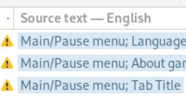

By "errors" Poedit means:

1. If line ends not on same punctuation symbol as source (. , ! : etc).

2. If source string ends on newline, but your translation don't.

You can ignore this warnings as they don't break anything (unless source string strictly require you to add newline or have same end punctuation) if your language doesn't require same punctuation as English.

_You can disable sorting lines with errors first. To do so: go to top bar, `View` -> `Show Warnings`._ 

* You can sort list of strings with different filters. For example, sort untranslated lines first. To do so `View` menu:

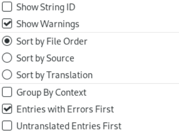

* You can enable/disable string(s) (which in gettext terminology known as "fuzzy"). Such strings will be ignored by GodSVG.


If string is disabled - it will be colored in orange.


* Once you pick some string, in right-bottom corner there will be comment button:


This is translation comments, meant for translators to communicate with each other, or to document their reasoning for some translation choices. If there no comment, you can add one. You can edit comment if there one.

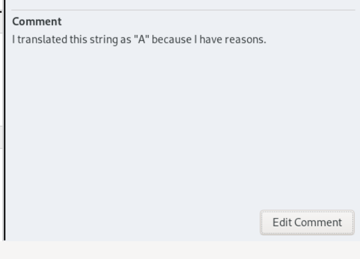

* Strings that includes comment will have this icon:


* With `Alt + Enter` or top bar `Translation` -> `Properties`, you can edit properties of translation file, such as what locale should be used, contact information of translator, etc.

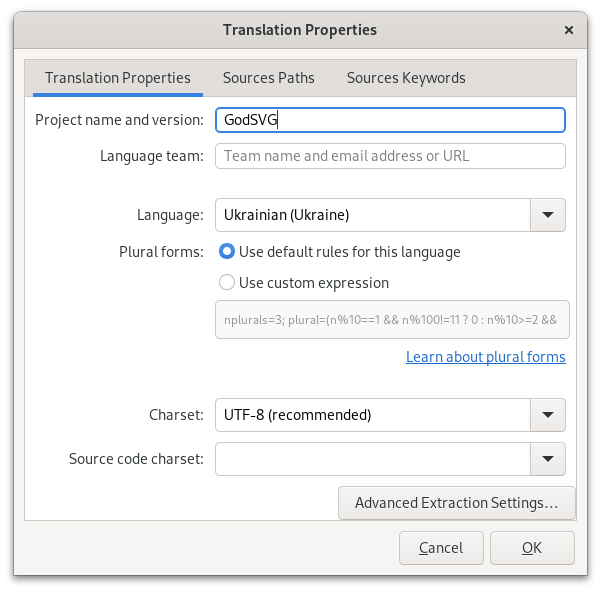

Usually, there no need to change them if you created your translation file from `pot` using Poedit. 

* You can right click on any string to open context menu to access some additional operations.

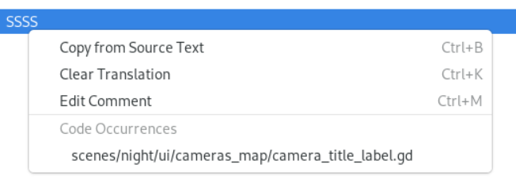

## Working on translation without Poedit

First thing that you should know is that `pot` and `po` files are, in fact, same files. `pot` is just template file, that has all information that `po` has, minus regional and data information, such as locale code (`uk_UA`, `en_US`, etc) or pluralization formula (more about pluralization formula you can check in [gettext manual](https://www.gnu.org/software/gettext/manual/html_node/Plural-forms.html)) that you need need to fill.

#### Create new translation without Poedit

1. Copy `pot` file. Change extension of copied file from `pot` to `po` and instead of `GodSVG` give it locale code of language that you want to translate.

_About locale code you can learn in [Adding new translation](#adding-new-translation)._

2. There you will found something like that:

```gettext
#, fuzzy
msgid ""
msgstr ""
"Project-Id-Version: One Night at Godot\n"
"MIME-Version: 1.0\n"
"Content-Type: text/plain; charset=UTF-8\n"
"Content-Transfer-Encoding: 8-bit\n"
```

As of now, there no information about locale and plural formula. To add language locale, paste text below before `"MIME-Version: 1.0\n"`:

```gettext
"Language: uk_UA\n"
```

Where you should replace `uk_UA` with your locale code.

And if pluralization is needed, add formula after `"Content-Transfer-Encoding: 8-bit\n"`:

```gettext
"Plural-Forms: nplurals=3; plural=(n%10==1 && n%100!=11 ? 0 : n%10>=2 && "
"n%10<=4 && (n%100<12 || n%100>14) ? 1 : 2);\n"
```

_This formula will work with some Slavic languages, such as Ukrainian, Belarusian, Russian._

End result should look like this:

```gettext
"Project-Id-Version: GodSVG\n"
"Language: uk_UA\n"
"MIME-Version: 1.0\n"
"Content-Type: text/plain; charset=UTF-8\n"
"Content-Transfer-Encoding: 8-bit\n"
"Plural-Forms: nplurals=3; plural=(n%10==1 && n%100!=11 ? 0 : n%10>=2 && "
"n%10<=4 && (n%100<12 || n%100>14) ? 1 : 2);\n"
```

There other information that you can fill, but it is not required for your translation to work. Learn about more possible entries [here](https://www.gnu.org/software/gettext/manual/html_node/Header-Entry.html).

3. You can now translate using any text editor.

[Check syntax if you not familiar with gettext](#syntax).

#### Updating existing translation

Updating existing translation without using any additional tools, like Poedit or diff manager, will be more time consuming and will require many manual work. If you can, consider using diff tool to found which string you need to add from `pot` file to your `po`.
Or better use [Poedit](#translations).

1. Open translation file that you want to update using text editor.

2. Open pot file using text editor.

3. If you can't use Poedit to automatically update `po` file, use search function of your text editor in `pot` file and look for entries that `po` file doesn't have. Using Github history for GodSVG also might help track down what has been changed.

4. Once you make sure that you imported all missing strings from `pot`, translate.

[Check syntax if you not familiar with gettext](#syntax).

#### Syntax

More in-depth about syntax of `po`format you can learn [here](https://www.gnu.org/software/gettext/manual/html_node/PO-Files.html). Most of features were explained in [Quick guide on how to work with Poedit](#quick-guide-on-how-to-work-with-poedit), and how to graphically use them with Poedit. All of them is available from plain text as well.

But here quick recap of most important syntax:
```gettext

# Simplest entry.

#  Comment for translators (add 2 spaces after #)
#: lib/error.c:116 (path where this string was extracted from source scripts)
msgid "Unknown system error" (message id and source string that you need to translate)
msgstr "Error desconegut del sistema" (your translated string)

# Example of plural message.
msgid untranslated-string-singular
msgid_plural untranslated-string-plural
msgstr[0] translated-string-case-0
...
msgstr[N] translated-string-case-n

# Example of long messages.
msgid ""
"Here is an example of how one might continue a very long string\n"
"for the common case the string represents multi-line output.\n"

# make string fuzzy. Add word "fuzzy" after #,
#: lib/error.c:116
#, fuzzy
msgid "Unknown system error"
msgstr "Error desconegut del sistema"

# Add context
#: lib/error.c:116
#, fuzzy
msgctxt "Context String"
msgid "Unknown system error"
msgstr "Error desconegut del sistema"
```

That's mostly all syntax that you need to know. But most of the time you will fill `msgstr` of each entry.